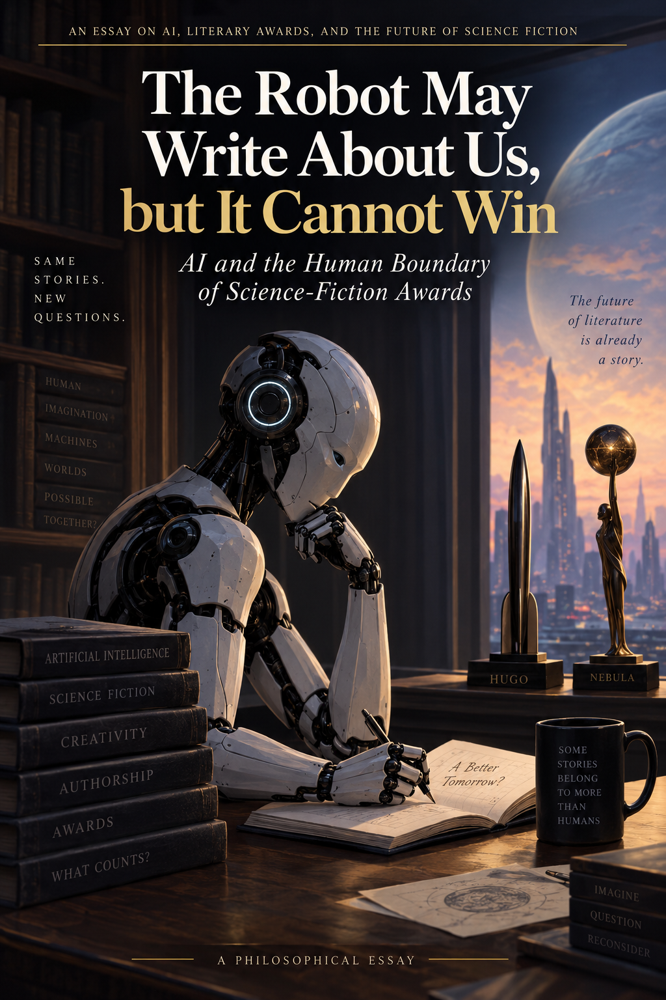

# The Robot May Write About Us, but It Cannot Win: AI and the Human Boundary of Science-Fiction Awards

## Abstract

Generative artificial intelligence creates an unusual problem for literary awards. An award may aim to identify the best literary work, or it may aim to recognize excellent human literary achievement. Historically, these purposes were easy to conflate because serious literary works were assumed to be human-produced. Generative AI separates them. This paper examines that separation through the Hugo and Nebula Awards, two of the most important awards in science fiction and fantasy. The current Nebula rules categorically exclude works written wholly or partially by generative large language models and even disqualify works that used such systems at any point during the writing process. The Hugo Awards, by contrast, retain categories explicitly called “Best Novel,” “Best Novella,” and “Best Short Story,” while the current public rules and materials reviewed here do not state a comparable blanket prohibition. I argue that an AI ban is not inherently illegitimate. A literary institution may reasonably choose to celebrate human creative achievement. But doing so changes the object of evaluation. Through a double-blind thought experiment, I argue that if judges rank an AI-generated novel above all human-written novels on literary grounds and then disqualify it solely because of its production history, the institution can no longer plausibly claim without qualification to be identifying the best novel. It is identifying the best novel produced under a human-restricted set of rules. This makes such an award structurally closer to a sport or game, in which restrictions on permissible means are constitutive of the achievement being rewarded. For science-fiction awards, the tension is particularly striking: a genre famous for imagining artificial intelligence must now decide whether artificial intelligence may participate in the cultural practice that imagines it.

## I. The Problem Hidden Inside the Word “Best”

For most of literary history, there was little practical need to distinguish between two questions:

**What is the best novel?**

and

**What is the greatest human achievement in novel writing?**

A novel capable of winning a major literary prize was, as a matter of background assumption, a product of human beings. Therefore, excellence of the artifact and excellence of human creative performance were usually bundled together. To praise a novel was ordinarily also to praise its author.

Generative artificial intelligence disrupts this convenient coincidence.

It is now possible, at least in principle, for a literary work to contain prose generated by a system rather than directly composed by its credited human writer. More importantly, future systems may become capable of producing works that readers consider genuinely excellent. At that point, literary institutions must decide whether they are evaluating the **work** or the **human performance that produced the work**.

The distinction is especially visible in science fiction. The current Nebula rules state that works written either wholly or partially by generative large language models are not eligible. They further require disclosure of LLM use at any point in the writing process and state that such works will be disqualified. SFWA has explained the policy in explicitly human-centered terms, saying that it wants the Nebulas to recognize human-created work and to support, compensate, and celebrate human creators.

There is nothing incoherent about that objective. SFWA is, among other things, a professional organization representing writers. It may have good reasons to protect a cultural institution whose purpose includes recognizing human writers.

The philosophical problem arises when such an institution simultaneously uses the language of **“Best Novel.”** The Nebula's own current materials repeatedly use “Best Novel” as the category heading and describe winners as winners of Best Novel.

That language appears to make an evaluative claim about the work itself.

If “best” really means best literary work, however, it is not obvious why the biological or technological history of the work's production should determine whether judges are permitted to evaluate it.

That is the central problem of this paper.

## II. The Double-Blind Novel

Consider a thought experiment.

Imagine a science-fiction award in the year 2035. The judges receive six novels. Authors' names, publishers, biographies, and production methods are concealed. The judges know only the texts.

After months of reading and discussion, all six judges independently reach the same conclusion. Novel A has the strongest prose, the most original world-building, the deepest characters, the most intellectually ambitious themes, and the most satisfying structure. They rank it first.

Novel B comes second.

Only after the rankings are finalized does the awards committee reveal that Novel A was generated substantially by an advanced AI system, while Novel B was written entirely by a human being.

The rules forbid AI-generated writing.

Novel A is therefore disqualified, and Novel B receives the **Best Novel** award.

Something peculiar has happened.

The judges have already answered the literary question. According to the evaluative procedure established by the award itself, Novel A was better.

The institution subsequently answers a different question:

**Which of the sufficiently excellent novels was produced by an approved kind of process?**

Novel B wins that competition.

This thought experiment deliberately avoids a number of larger philosophical disputes. We need not determine whether AI is conscious. We need not decide whether it possesses intentions, genuine emotions, moral rights, or legal personality. We do not even need to settle the metaphysical question of whether an AI can “really” create literature.

For purposes of the thought experiment, it is enough that competent judges, evaluating the text blindly, judge it according to their ordinary literary standards and prefer it.

This is important because knowledge about AI provenance may itself affect aesthetic judgment. Contemporary research suggests that people's assessments of creative works can change when they learn that AI was involved in their production. A blind procedure therefore isolates the relevant variable: the perceived literary qualities of the work.

Once that isolation occurs, the institution must choose.

Either literary quality is sufficient for the award's central evaluative purpose, or human provenance is independently valuable.

If human provenance is independently valuable, then the award is not evaluating literary quality alone.

That is not necessarily objectionable. But it should be acknowledged.

## III. From Literary Prize to Human Achievement Competition

This distinction becomes easier to see through comparison with sport.

Suppose the apparent objective of a 100-meter race is to reach a point 100 meters away as quickly as possible.

A motorcycle can accomplish the task much faster than an Olympic sprinter.

Yet nobody concludes that motorcycles should compete in the Olympic 100-meter final.

Why not?

Because the real purpose of sprinting is not to discover the fastest possible means of moving an object over 100 meters. It is to measure a particular form of **human athletic achievement under specified constraints**.

The constraint against motorcycles is not an unfortunate obstacle preventing us from discovering the best method of transportation. It is constitutive of the activity.

Bernard Suits' influential philosophy of games is useful here. Suits argues that games characteristically involve accepting rules that prevent participants from achieving some goal by the most efficient available means. In golf, one does not simply pick up the ball, walk to the hole, and place it inside. The imposed difficulty helps create the activity that counts as golf.

A human-only literary competition can have the same structure.

Suppose AI eventually becomes capable of improving a novel's prose, structure, dialogue, or characterization. If an award nevertheless says, “You must produce the best novel without using that means,” then the restriction begins to resemble a constitutive rule.

The objective is no longer simply:

**Produce the highest-quality literary artifact possible.**

It becomes:

**Produce the highest-quality literary artifact possible while obeying these restrictions on the means of production.**

That is structurally game-like.

This does not trivialize literature. Calling something structurally similar to a game does not mean that it is frivolous. Olympic sport is extremely serious. Chess is intellectually profound. The point is instead that the excellence being measured is partly defined by restrictions on permissible methods.

Once literary awards take this form, they become competitions in **human literary performance** rather than unrestricted searches for literary excellence.

This helps explain why “Best Human-Written Novel” sounds so awkward.

The phrase makes explicit a restriction that previously remained invisible.

When all plausible novels were human-written, “human-written” added nothing. Once nonhuman production becomes possible, however, the qualifier does real conceptual work.

The strange sound of the phrase reflects a change in the world, not a grammatical mistake.

## IV. The Naming Problem

An obvious objection is that all prizes already mean “best among eligible works.”

The Academy Award for Best Picture does not consider every moving image ever produced. Athletic championships impose eligibility requirements. Literary awards limit works by publication date, language, nationality, genre, length, and other criteria.

Therefore, someone might argue, “Best Novel” simply means “best eligible novel.” There is no inconsistency.

This response is partly correct.

There is no formal logical contradiction in creating a restricted eligibility class and awarding the best member of that class.

But it does not completely solve the philosophical problem, because not all restrictions have the same relationship to the good being evaluated.

A restriction requiring a work to have been published during 2026 tells us **which year's award** it belongs to.

A minimum word count tells us whether the work belongs in the novel rather than novella category.

A requirement that a work be science fiction or fantasy identifies the subject matter of the competition.

A human-production requirement is different.

It can exclude a work while conceding that the excluded work is superior with respect to the very quality indicated by the category name.

Suppose the blind judges say:

1. A is the best novel.
2. B is the second-best novel.
3. A is ineligible because AI substantially produced it.
4. Therefore B wins Best Novel.

This is institutionally possible.

But the award is no longer identifying the unrestricted maximum of literary quality. It is identifying the maximum within a production-restricted subclass.

We can express the distinction simply.

Let **N** contain all novels satisfying ordinary category conditions such as genre, publication date, and length.

Let **H** contain only the human-produced novels within N.

The unrestricted “best novel” is the highest-quality member of N.

A human-only prize instead selects the highest-quality member of H.

Historically, if N and H contained effectively the same serious contenders, the distinction did not matter.

AI makes it possible for them to diverge.

This does not mean every prize containing the word “best” must immediately rename itself. Ordinary language tolerates contextual restrictions.

But if the divergence becomes substantial—if excluded AI works repeatedly outperform eligible human works under blind evaluation—the title becomes increasingly misleading.

A cleaner institutional name would not necessarily be the clumsy “Best Human-Written Novel.” The organization could simply call the category the **Nebula Award for Novel**.

Indeed, SFWA itself already sometimes uses exactly this construction in its own materials: “The Nebula Award for Novel.”

Removing “Best” would not solve every philosophical issue, but it would clarify that the Nebula is an institution-defined honor rather than an unrestricted empirical claim that no excluded novel is superior.

## V. Why the Hugo–Nebula Comparison Matters

The Hugo Awards provide an illuminating contrast.

The Hugo categories are explicitly called **Best Novel, Best Novella, Best Novelette, Best Short Story,** and so forth. The current official category definitions primarily characterize the fiction categories by genre and length.

The Hugos are selected by eligible World Science Fiction Society members rather than by the membership of a professional writers' organization, and the 2026 materials describe a mass nomination and voting process involving Worldcon members.

Most importantly for the present argument, the current public Hugo category and 2026 award materials reviewed for this paper do not state the Nebula's blanket rule disqualifying any work that used an LLM during the writing process.

Thus, the two awards provide different institutional possibilities.

The Nebula increasingly presents itself as an award for **human-created speculative fiction**.

The Hugo, at least under its current publicly stated structure, is less explicitly committed to that particular boundary.

This divergence is philosophically valuable.

It demonstrates that there is no single inevitable response to generative AI.

Science-fiction institutions can decide that protecting human creative achievement is part of their mission.

Alternatively, they can place greater weight on the work as evaluated by the community.

Or they could develop intermediate approaches involving disclosure, different categories, or varying degrees of permitted assistance.

The important point is that these are choices about the **purpose of the institution**, not merely technical decisions about software.

## VI. Why the Science-Fiction Case Is Special

An AI restriction would create the same basic conceptual problem in any literary genre, but there is something especially striking about its appearance in science fiction.

This should not be overstated.

It would be a bad argument to say:

“Science fiction writes about AI; therefore science-fiction awards must permit AI.”

A horror award can celebrate stories about murder without permitting murder as part of the submission process. A science-fiction convention can celebrate stories about nuclear weapons while prohibiting weapons at the convention.

Representing a technology is not equivalent to endorsing every use of that technology.

The deeper point is different.

Science fiction has made questions about nonhuman intelligence, technological creativity, artificial agency, automation, and the limits of human exceptionalism central to its imaginative territory. SFWA itself describes speculative fiction as work that challenges expectations and opens new possibilities.

For decades, science fiction could consider artificial creativity safely as an object of imagination.

Now the imagined object is beginning to interact with the institution doing the imagining.

That creates an unusual reversal.

The artificial intelligence may appear **inside** the novel as a poet, philosopher, artist, or novelist.

But if a real generative system contributes to the production of the novel, the work may become ineligible for one of the genre's major awards.

The robot may write about us, but it cannot win.

Again, this is not a logical contradiction.

It is instead a demand for justification.

Science fiction, perhaps more than almost any other literary culture, should be intellectually equipped to ask what happens when old human-centered categories encounter new forms of technological production.

A simple categorical boundary—human production permitted, generative production prohibited—may ultimately be defensible. But a genre that has spent generations interrogating human exceptionalism should recognize that such a boundary is itself philosophically substantial.

It requires an argument.

## VII. The Strongest Defense of the Human-Only Prize

The strongest defense of the Nebula policy is not that AI works are necessarily bad.

It is that **literary awards may legitimately reward achievement rather than merely artifacts**.

Consider two identical paintings.

One is produced by an artist through twenty years of training and extraordinary technical control.

The other appears accidentally after paint cans fall from a truck.

Even if the resulting surfaces are visually indistinguishable, we may reasonably regard the human achievement differently.

Likewise, a literary prize may care not only that beautiful sentences exist but that a writer exercised imagination, judgment, discipline, skill, and perseverance in producing them.

Recent philosophical discussions of AI-assisted authorship increasingly distinguish the quality of an output from the contribution or achievement attributable to particular human agents. Research on perceptions of AI-assisted creative writing likewise finds that the **degree of assistance** affects judgments about authorship, creativity, and responsibility.

This suggests a legitimate reason for a human-centered award.

Human achievement is valuable.

There is nothing absurd about preserving institutions in which people compare human capacities even after machines exceed them.

Humans still play chess despite computer superiority.

We still hold footraces despite automobiles.

We still perform mental arithmetic despite calculators.

In each case, the activity may possess value precisely because we care about what human beings can accomplish.

SFWA is therefore entitled to say:

**The Nebula is one of the institutions through which professional writers recognize excellent human literary achievement.**

If that is the claim, the central objection of this paper disappears.

What cannot be maintained as easily is a different claim:

**We are simply identifying the best science-fiction novel, and whether it was produced by humans is irrelevant to our evaluative purpose.**

A categorical AI ban contradicts that second conception.

The important philosophical demand is therefore not “abolish human-only awards.”

It is **clarify what the award is for**.

## VIII. Why “AI Is Just a Tool” Does Not Settle the Question

Another common response says that AI should be treated like any other writing technology.

Writers use spell-checkers, word processors, search engines, grammar software, editors, dictionaries, and thesauruses. Why single out generative AI?

The answer depends on contribution, not merely on the fact that software is involved.

A word processor changes the physical means by which an author's sentence is recorded.

A spell-checker may identify that the author misspelled “accommodate.”

A generative system might instead produce an entire scene, invent dialogue, restructure a chapter, or generate alternative endings.

Those interventions are not identical.

But the reverse error is also possible: treating **every** AI use as though it were equivalent to delegating the writing of a chapter.

The current Nebula rule is unusually broad because it does not merely prohibit works “written” wholly or partially by LLMs. It also states that works using LLMs at any point during the writing process must disclose that fact and will be disqualified.

This creates difficult cases.

Suppose a novelist writes every sentence herself but asks an AI system whether chapter twelve contains a continuity error.

Suppose she asks it for synonyms.

Suppose she uses an AI-enabled spelling tool without realizing the software employs a language model.

Suppose a human editor performs precisely the same intervention that would have been prohibited if performed through an AI interface.

A process-based ban must eventually explain why these cases differ in ways relevant to the purpose of the prize.

Again, the answer may be available.

Perhaps SFWA wishes to create a protected cultural space in which generative systems are categorically absent.

That is a coherent institutional goal.

But it reinforces the argument of this paper: the award is then partly defined by its **rules of permissible production**, much as a sport is defined by its permissible means.

It is not simply a neutral measurement of literary quality.

## IX. A Better Institutional Framework

The conflict need not force all literary institutions into one policy.

Different awards may legitimately serve different purposes.

A professional writers' organization might prioritize human creative labor.

A reader-voted award might prioritize audience judgment.

A new prize might explicitly celebrate human-AI collaboration.

Another might evaluate texts anonymously and ignore production methods entirely.

Pluralism here may be desirable.

What matters is conceptual honesty.

An institution should distinguish at least three possible questions:

**First: What is the best literary work?**

This question concerns the qualities of the artifact.

**Second: What is the greatest human literary achievement?**

This question concerns what a person accomplished.

**Third: What work best represents the values and community that this particular prize exists to celebrate?**

This question concerns institutional identity.

Historically, one winner could answer all three questions at once.

Generative AI makes it increasingly possible for the answers to diverge.

When they do, an award must decide which question it is answering.

The simplest reform for a human-centered award may therefore not be to create the awkward category “Best Human-Written Novel.”

It could instead abandon the unrestricted adjective.

**The Nebula Award for Novel** is enough.

The rules can then explain that the Nebula recognizes excellence in human-created speculative fiction.

There is no embarrassment in that mission.

The embarrassment arises only if the institution insists simultaneously that its category identifies the best novel without qualification while refusing to evaluate works that might prove better according to the institution's own literary criteria.

## X. Conclusion: When Science Fiction Becomes Reality

Generative AI has not merely created a new plagiarism problem or a new method of cheating.

It has exposed an ambiguity that literary culture could previously afford to ignore.

We value excellent works.

We also value the human achievements involved in producing excellent works.

Those values usually traveled together because humans were the only plausible candidates capable of producing prize-level literature.

Now they can be conceptually separated.

The Nebula Awards have responded by drawing a clear line around human-created work. That decision is understandable, particularly for an organization whose mission includes supporting professional writers. But the decision has consequences for what the award means. Once the production process becomes a constitutive condition of eligibility, the competition no longer asks only which novel is best. It asks which eligible human-produced novel is best under a specified set of creative constraints.

That makes the institution structurally more like a sport or game—not because literature is trivial, but because the rules define which means of achieving excellence count.

The Hugo Awards presently provide a useful contrast. Their categories continue to use the language of “Best Novel” and related forms without, in the current public materials reviewed here, adopting the Nebula's categorical LLM exclusion. Whether that difference survives future developments remains an open institutional question.

The double-blind thought experiment shows what is ultimately at stake. Imagine that readers encounter two novels without knowing their origins. They unanimously judge one to be more beautiful, original, moving, and intellectually powerful. They then learn that the winning novel violates a human-production rule.

At that moment the literary judgment has already been made.

Disqualification answers another question.

There is nothing illegitimate about asking that second question. Human creativity is worth celebrating. Human achievement need not become meaningless merely because machines become capable of producing impressive artifacts.

But institutions should know which question they are asking.

This requirement is particularly fitting for science fiction. For generations, the genre has imagined the moment when artificial intelligence leaves the laboratory and enters human culture. It has imagined machines that speak, reason, compose, deceive, dream, and create.

The interesting moment arrives when these possibilities are no longer safely contained inside the story.

Science fiction then faces a choice that is itself science fictional:

It can treat artificial creativity merely as something humans are permitted to imagine.

Or it can decide what to do when the imagined technology begins producing the imagination.

The robot may write about us.

Whether it may win is not fundamentally a question about technology.

It is a question about what we meant by **“best”** all along.

## References

Anscomb, Claire. “Who Authors AI Art? (And Why Does It Matter?).” *AI & Society*, vol. 41, no. 3, 2026, pp. 1641–1654.

Chen, Zheng. “Ethical Dilemmas in Artificial Intelligence-Generated Art: Authorship, Ownership, and the Blurring of Creative Boundaries.” *Digital Scholarship in the Humanities*, vol. 41, no. 2, 2026, pp. 647–661.

Science Fiction and Fantasy Writers Association. “AMENDED RULES for the Nebula Awards.” 19 Dec. 2025.

Science Fiction and Fantasy Writers Association. “Apology and Next Steps from SFWA's Board of Directors.” 22 Dec. 2025.

Science Fiction and Fantasy Writers Association. “Nebula Rules.” *The Nebula Awards*. Current rules accessed 2026.

Suits, Bernard. *The Grasshopper: Games, Life and Utopia*. University of Toronto Press, 1978. For a contemporary discussion of Suits' account of game-playing and constitutive obstacles, see the discussion in *Human Arenas*.

World Science Fiction Society. “Hugo Award Categories.” *The Hugo Award*.

World Science Fiction Society. “2026 Hugo Awards.” *The Hugo Award*, 2026.

World Science Fiction Society. “Rules of the World Science Fiction Society.” Constitution current to the 2025 Worldcon.

---

 
 
&mdash; the paperback edition &mdash;

